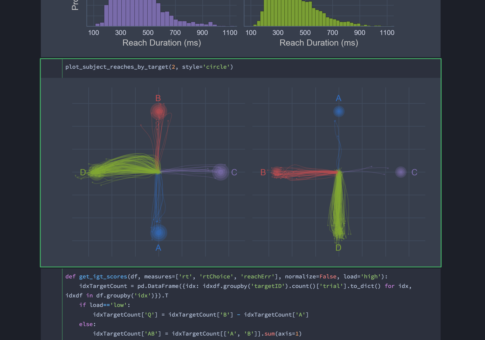
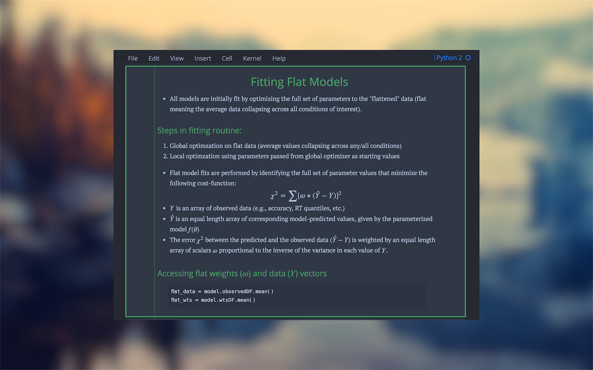
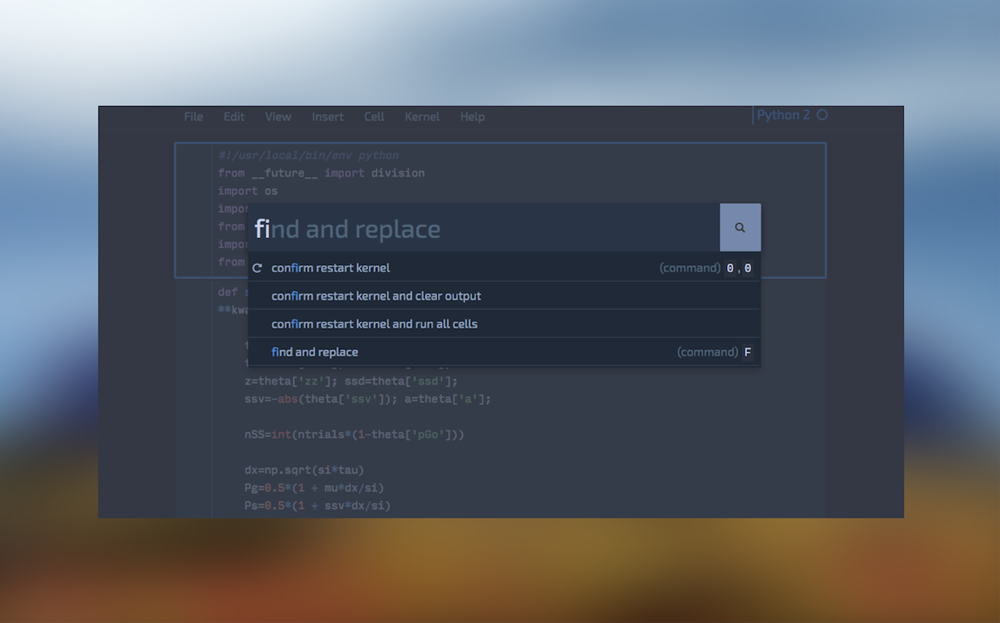
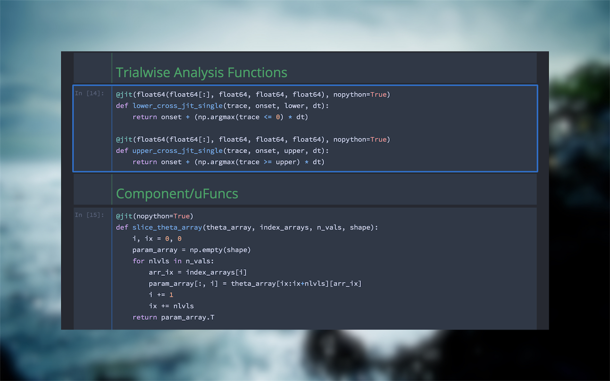
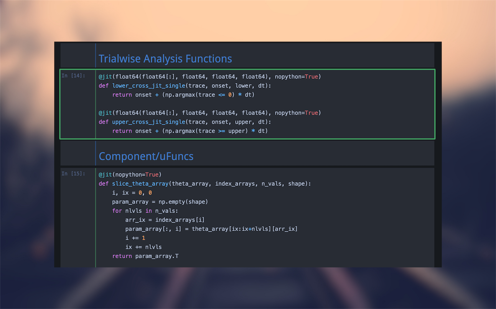

# jupyterthemes
## Theme-ify your Jupyter Notebooks!

|    Author    |                 Version                  |                  Status                  |                   Demo                   |
| :----------: | :--------------------------------------: | :--------------------------------------: | :--------------------------------------: |
| Kyle Dunovan |  |  | [](http://mybinder.org:/repo/dunovank/jupyter-themes) |

###### *plotting style*


###### *markdown/equations*


###### *pandas dataframes*


###### *command palette*


###### *oceans16 syntax*


###### *grade3 syntax*


###### *onedork syntax*


###### *chesterish syntax*


### Links
* [jupyterthemes on PyPI](https://pypi.python.org/pypi/jupyterthemes/)
* [jupyterthemes on GitHub](https://github.com/dunovank/jupyter-themes)

### Requirements
* Python 2.7, 3.3, 3.4, 3.5, 3.6
* Jupyter ([Anaconda](https://www.continuum.io/downloads) recommended)

### Install with pip
```sh
# install/upgrade to latest version
pip install --upgrade jupyterthemes
```

### Known issues
- **refreshing / removing / resetting:** depending on your system, browser, etc., you may need to empty your browser cache after installing a new theme (`-t`) or attempting to restore the default (`-r`) in order for those changes to take effect. (see discussion [here](https://github.com/dunovank/jupyter-themes/issues/86)).
- **install issue:** if you get an error saying `jt` is not recognized, try [this](https://github.com/dunovank/jupyter-themes/issues/92#issuecomment-300688587) fix.
- **slow render when scrolling:** fix available [here](https://github.com/dunovank/jupyter-themes/issues/117#issuecomment-296391443)
- **for best results:** use notebook>=5.0 (`pip install --upgrade notebook`)


### Command Line Usage
```
jt  [-h] [-l] [-t THEME] [-f MONOFONT] [-fs MONOSIZE] [-nf NBFONT]
    [-nfs NBFONTSIZE] [-tf TCFONT] [-tfs TCFONTSIZE] [-dfs DFFONTSIZE]
    [-m MARGINS] [-cursw CURSORWIDTH] [-cursc CURSORCOLOR] [-vim]
    [-cellw CELLWIDTH] [-lineh LINEHEIGHT] [-altp] [-P] [-T] [-N]
    [-r] [-dfonts]
```

#### Description of Command Line options
| cl options            |   arg   |  default   |
| :-------------------- | :-----: | :--------: |
| Usage help            |   -h    |     --     |
| List Themes           |   -l    |     --     |
| Theme Name to Install |   -t    |     --     |
| Code Font             |   -f    |     --     |
| Code Font-Size        |   -fs   |     11     |
| Notebook Font         |   -nf   |     --     |
| Notebook Font Size    |  -nfs   |     13     |
| Text/MD Cell Font     |   -tf   |     --     |
| Text/MD Cell Fontsize |  -tfs   |     13     |
| Pandas DF Fontsize    |  -dfs   |     9      |
| Output Area Fontsize  |  -ofs   |    8.5     |
| Intro Page Margins    |   -m    |    auto    |
| Cell Width            | -cellw  |    980     |
| Line Height           | -lineh  |    170     |
| Cursor Width          | -cursw  |     2      |
| Cursor Color          | -cursc  |     --     |
| Alt Prompt Layout     |  -altp  |     --     |
| Style Vim NBExt*      |  -vim   |     --     |
| Toolbar Visible       |   -T    |     --     |
| Name & Logo Visible   |   -N    |     --     |
| Reset Default Theme   |   -r    |     --     |
| Force Default Fonts   | -dfonts |     --     |


### Command Line Examples
```sh
# list available themes
# onedork | grade3 | oceans16 | chesterish | monokai | solarizedl | solarizedd
jt -l

# select theme...
jt -t chesterish

# restore default theme
# NOTE: Need to delete browser cache after running jt -r
# If this doesn't work, try starting a new notebook session.
jt -r

# toggle toolbar ON and notebook name ON
jt -t grade3 -T -N

# set code font to 'Roboto Mono' 12pt
# (see monospace font table below)
jt -t onedork -f roboto -fs 12

# set code font to Fira Mono, 11.5pt
# 3digit font-sizes get converted into float (115-->11.5)
# 2digit font-sizes > 25 get converted into float (85-->8.5)
jt -t solarizedd -f fira -fs 115

# set font/font-size of markdown (text cells) and notebook (interface)
# see sans-serif & serif font tables below
jt -t oceans16 -tf merriserif -tfs 10 -nf ptsans -nfs 13

# adjust cell width (% screen width) and line height
jt -t chesterish -cellw 90% -lineh 170

# or set the cell width in pixels by leaving off the '%' sign
jt -t solarizedl -cellw 860

# fix the container-margins on the intro page (defaults to 'auto')
jt -t monokai -m 200

# adjust cursor width (in px) and make cursor red
# options: b (blue), o (orange), r (red), p (purple), g (green), x (font color)
jt -t oceans16 -cursc r -cursw 5

# choose alternate prompt layout (narrower/no numbers)
jt -t grade3 -altp

# my two go-to styles
# dark
jt -t onedork -fs 95 -altp -tfs 11 -nfs 115 -cellw 88%
# light
jt -t grade3 -fs 95 -altp -tfs 11 -nfs 115 -cellw 88%
```


### Set Plotting Style (from within notebook)
`jtplot.style()` makes changes to matplotlib's rcParams dictionary so that figure aesthetics match those of a chosen jupyterthemes style. Note, these commands do not need to be re-run every time you generate a new plot, just once at the beginning of your notebook or whenever style changes are desired after that.

For instance, I include the following two lines in my `~/.ipython/profile_default/startup/startup.ipy` file so this is done  automatically whenever I open a new notebook:


```py
# import jtplot submodule from jupyterthemes
from jupyterthemes import jtplot

# currently installed theme will be used to
# set plot style if no arguments provided
jtplot.style()
```

Some additional examples for setting "context" (taken from [seaborn](https://seaborn.pydata.org/tutorial/aesthetics.html#scaling-plot-elements-with-plotting-context-and-set-context)) and controlling various figure properties...

```py
# import jtplot
from jupyterthemes import jtplot

# you can select an alternative theme's plot style by name
# onedork | grade3 | oceans16 | chesterish | monokai | solarizedl | solarizedd
jtplot.style('onedork')

# set "context" (paper, notebook, talk, or poster)
# & font scale (scalar applied to labels, legend, etc.)
jtplot.style('grade3', context='paper', fscale=1.4)

# turn on X- and Y-axis tick marks (default=False)
# and turn off the axis grid lines (default=True)
jtplot.style(ticks=True, grid=False)

# set the default figure size
# x (length), y (height)
jtplot.figsize(x=6., y=5.)

# or just adjust the aspect ratio
# new_length = length * aspect
jtplot.figsize(aspect=1.2)

# fully reset matplotlib default rcParams
jtplot.reset()
```


#### Monospace Fonts (code cells)
| -f arg      | Monospace Font           |
| :---------- | :----------------------- |
| anka        | Anka/Coder               |
| anonymous   | Anonymous Pro            |
| aurulent    | Aurulent Sans Mono       |
| bitstream   | Bitstream Vera Sans Mono |
| bpmono      | BPmono                   |
| code        | Code New Roman           |
| consolamono | Consolamono              |
| cousine     | Cousine                  |
| dejavu      | DejaVu Sans Mono         |
| droidmono   | Droid Sans Mono          |
| fira        | Fira Mono                |
| firacode    | Fira Code                |
| generic     | Generic Mono             |
| hack        | Hack                     |
| hasklig     | Hasklig                  |
| inconsolata | Inconsolata-g            |
| inputmono   | Input Mono               |
| liberation  | Liberation Mono          |
| meslo       | Meslo                    |
| office      | Office Code Pro          |
| oxygen      | Oxygen Mono              |
| roboto      | Roboto Mono              |
| saxmono     | saxMono                  |
| source      | Source Code Pro          |
| sourcemed   | Source Code Pro Medium   |
| ptmono      | PT Mono                  |
| ubuntu      | Ubuntu Mono              |

#### Sans-Serif Fonts
| -nf/-tf arg   | Sans-Serif Font   |
| :------------ | :---------------- |
| opensans      | Open Sans         |
| droidsans     | Droid Sans        |
| exosans       | Exo_2             |
| latosans      | Lato              |
| ptsans        | PT Sans           |
| robotosans    | Roboto            |
| sourcesans    | Source Sans Pro   |

#### Serif Fonts
| -nf/-tf arg   | Serif Font       |
| :------------ | :--------------- |
| loraserif     | Lora             |
| ptserif       | PT Serif         |
| georgiaserif  | Georgia          |
| cardoserif    | Cardo            |
| crimsonserif  | Crimson Text     |
| ebserif       | EB Garamond      |
| merriserif    | Merriweather     |
| neutonserif   | Neuton           |
| goudyserif    | Sorts Mill Goudy |
