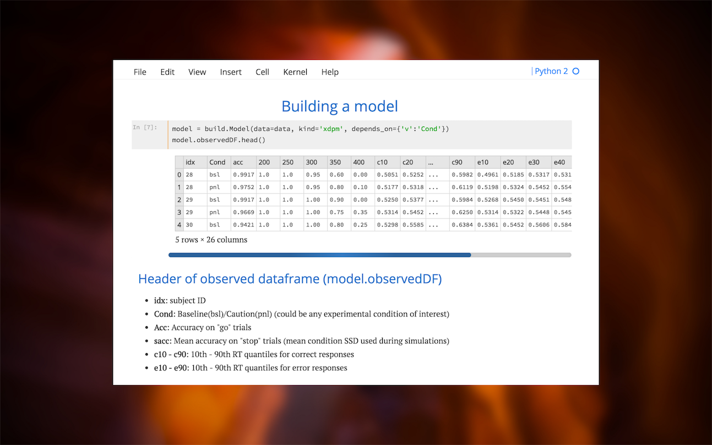
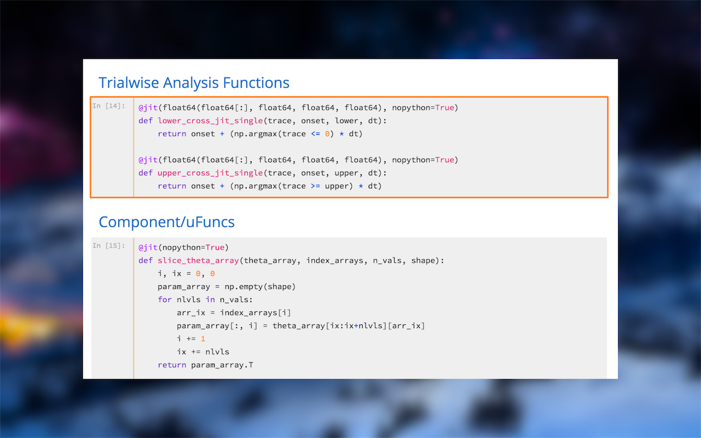
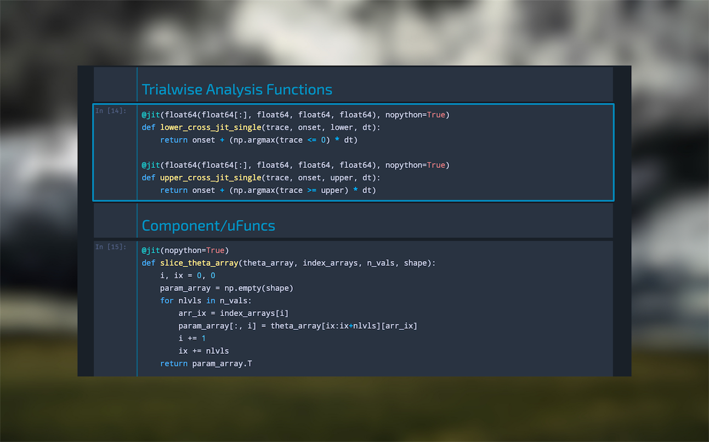

# jupyterthemes
## Theme-ify your Jupyter Notebooks!

###### *plots & equations*


###### *markdown & text cells*


###### *pandas dataframes*


###### *oceans16 syntax*

###### *grade3 syntax*

###### *onedork syntax*

###### *chesterish syntax*


### TravisCI Build status:


### Install with pip
```sh
pip install jupyterthemes
```

### Links
[jupyterthemes on PyPI](https://pypi.python.org/pypi/jupyterthemes/)
[jupyterthemes on GitHub](https://github.com/dunovank/jupyter-themes)


### Known Issues
* **UPDATE**: lesscpy has added support for 3.5 to their development branch but still waiting for this to make it's way into the official release on pypi. Soon...

* jupyterthemes relies on [lesscpy](https://github.com/lesscpy/lesscpy) to compile the custom arguments supplied by the user into into the css body that eventually gets saved as custom.css in your jupyter config directory.

* Unfortunately, lesscpy currently only supports up to Python 3.4. If you're running Python 3.5 you can still install and use jupyterthemes but you won't be able to modify the default settings (e.g., font, font-size, cell width, etc.). See [*Examples for 3.5 Users*](https://github.com/dunovank/jupyter-themes/tree/develop#examples-for-python-35-users).


### Command Line Usage
```
usage: jt [-h] [-l] [-t THEME] [-f MONOFONT] [-fs MONOSIZE] [-nf NBFONT]
          [-nfs NBFONTSIZE] [-tf TCFONT] [-tfs TCFONTSIZE]
          [-cursw CURSORWIDTH] [-cursc CURSORCOLOR] [-cellw CELLWIDTH]
          [-lineh LINEHEIGHT] [-alt] [-vim] [-T] [-N] [-r]
```

|        options        |   arg     |     default   |
|:----------------------|:---------:|:-------------:|
| Usage help            |  -h       |      --       |
| List Themes           |  -l       |      --       |
| Theme Name to Install |  -t       |      --       |
| Code Font             |  -f       |   droidmono   |
| Code Font-Size        |  -fs      |      11       |
| Notebook Font         |  -nf      |    exosans    |
| Notebook Font Size    |  -nfs     |      13       |
| Text/MD Cell Font     |  -tf      |  georgiaserif |
| Text/MD Cell Fontsize |  -tfs     |      13       |
| Cell Width            |  -cellw   |      980      |
| Line Height           |  -lineh   |      170      |
| Cursor Width          |  -cursw   |       2       |
| Cursor Color          |  -cursc   |  [theme clr]  |
| Alt Text/MD Layout    |  -alt     |      --       |
| Style Vim NBExt*      |  -vim     |      --       |
| Toolbar Visible       |  -T       |      --       |
| Name & Logo Visible   |  -N       |      --       |
| Restore Default       |  -r       |      --       |
\* Vim extension compatibility provided by [alextfkd](https://github.com/alextfkd)

### Examples
```sh
# list available themes
# oceans16 | grade3 | chesterish | onedork
jt -l

# select theme...
jt -t chesterish

# toggle toolbar ON and notebook name ON
jt -t grade3 -T -N

# set code font to 'Roboto Mono' 12pt
# (see monospace font table below)
jt -t oceans16 -f roboto -fs 12

# set code font to Fira Mono, 11.5pt
# 3digit font-size gets converted into float (115-->11.5)
jt -t grade3 -f fira -fs 115

# set notebook & text-cell/markdown fonts
# (see sans-serif & serif font tables below)
jt -t onedork -nf ptserif -tf droidsans

# adjust cell width, line-height of codecells
jt -t chesterish -cellw 900 -lineh 170

# set block cursor, color red
jt -t onedork -cursw 8 -cursc r

# choose alternate txt/markdown layout
jt -t grade3 -alt

# restore default theme
jt -r
```

### Examples for Python 3.5 users:
```sh
# install a theme
jt -t grade3
# list theme
jt -l
# reset theme
jt -r

```

### Monospace Fonts (codecells)
| -f arg | Monospace Font |
|:--|:--|
|anka|Anka/Coder|
|anonymous|Anonymous Pro|
|aurulent|Aurulent Sans Mono|
|bitstream|Bitstream Vera Sans Mono|
|bpmono|BPmono|
|code|Code New Roman|
|consolamono|Consolamono|
|cousine|Cousine|
|dejavu|DejaVu Sans Mono|
|droidmono|Droid Sans Mono|
|fira|Fira Mono|
|firacode|Fira Code|
|generic|Generic Mono|
|hack|Hack|
|inconsolata|Inconsolata-g|
|liberation|Liberation Mono|
|meslo|Meslo|
|office|Office Code Pro|
|oxygen|Oxygen Mono|
|roboto|Roboto Mono|
|saxmono|saxMono|
|source|Source Code Pro|
|sourcemed|Source Code Pro Medium|
|ptmono|PT Mono|
|ubuntu|Ubuntu Mono|

### Sans-Serif Fonts
| -nf/-tf arg | Sans-Serif Font |
|:--|:--|
|opensans|Open Sans|
|droidsans|Droid Sans|
|latosans|Lato|
|ptsans|PT Sans|
|robotosans|Roboto|
|sourcesans|Source Sans Pro|
|amikosans|Amiko|
|exosans|Exo_2|
|nobilesans|Nobile|
|alegreyasans|Alegreya|
|armatasans|Armata|
|cambaysans|Cambay|
|catamaransans|Catamaran|
|franklinsans|Libre Franklin|
|frankruhlsans|Frank Ruhl|
|gothicsans|Carrois Gothic|
|gudeasans|Gudea|
|hindsans|Hind|
|jaldisans|Jaldi|
|makosans|Mako|
|merrisans|Merriweather Sans|
|mondasans|Monda|
|oxygensans|Oxygen Sans|
|pontanosans|Pontano Sans|
|puritansans|Puritan Sans|
|ralewaysans|Raleway|

### Serif Fonts
| -nf/-tf arg | Serif Font |
|:--|:--|
|georgiaserif|Georgia|
|ptserif|PT Serif|
|crimsonserif|Crimson Text|
|droidserif|Droid Serif|
|ebserif|EB Garamond|
|loraserif|Lora|
|merriserif|Merriweather|
|vesperserif|Vesper Libre|
|scopeserif|ScopeOne|
|sanchezserif|Sanchez|
|neutonserif|Neuton|
|rasaserif|Rasa|
|vollkornserif|Vollkorn|
